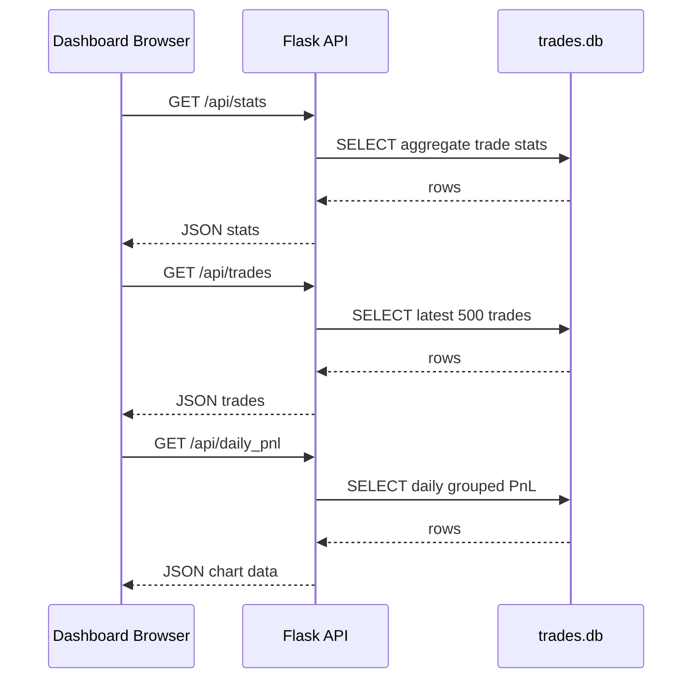

# API Reference

Generated: 2026-07-11

API server: `src/app.py`

Default runtime: Flask development server on `0.0.0.0:5000`.

The dashboard currently calls a hardcoded ngrok API base:

```text
https://turbine-bust-upload.ngrok-free.dev/api
```

Assumption: in local use, this ngrok URL forwards to the Flask server started by `start_all.bat`.

## Common Response Shape

Success:

```json
{
  "status": "success",
  "data": {}
}
```

Error:

```json
{
  "status": "error",
  "message": "exception message"
}
```

The current API generally returns HTTP `200` even for application errors; error state is represented in JSON.

## Endpoints

| Endpoint | Method | Parameters | Response | Error codes | Flow |
|---|---|---|---|---|---|
| `/` | GET | None | `web/dashboard.html` | Flask/static-file errors | Serves the dashboard HTML from `../web/dashboard.html`. |
| `/api/trades` | GET | None | `{status,data,count}` where `data` is latest 500 trades | JSON `{status:error}` on exception | Opens SQLite, selects trade fields ordered by `entry_time DESC`, returns rows. |
| `/api/stats` | GET | None | `{status,data}` with `overall`, `today`, `week`, `month` stats | JSON `{status:error}` on exception | Aggregates counts, closed/open trades, PnL, win/loss counts, average, max profit/loss. |
| `/api/daily_pnl` | GET | None | `{status,data}` list of `{date,trades,daily_pnl}` | JSON `{status:error}` on exception | Groups closed-trade PnL by date for last 30 days. |
| `/api/weekly_pnl` | GET | None | `{status,data}` list of `{week,trades,weekly_pnl}` | JSON `{status:error}` on exception | Groups closed-trade PnL by SQLite week for last 90 days. |
| `/api/monthly_pnl` | GET | None | `{status,data}` list of `{month,trades,monthly_pnl}` | JSON `{status:error}` on exception | Groups closed-trade PnL by month for last 365 days. |
| `/api/performance` | GET | None | `{status,data:{win_rate,best_symbols}}` | JSON `{status:error}` on exception | Calculates win rate and top 5 symbols by total PnL. |
| `/api/market_status` | GET | None | `{status,data,is_open}` | JSON `{status:error}` on exception | Uses local server time and weekday/trading-hour check. |

## Detailed Responses

### `GET /api/trades`

Query:

```sql
SELECT id, symbol, entry_price, exit_price, quantity,
       net_pnl as pnl, gross_pnl, strategy, exit_reason,
       entry_time, exit_time,
       CASE WHEN exit_time IS NULL THEN 'OPEN' ELSE 'CLOSED' END as status,
       exit_type
FROM trades
ORDER BY entry_time DESC
LIMIT 500
```

Example shape:

```json
{
  "status": "success",
  "data": [
    {
      "id": 1,
      "symbol": "TCS",
      "entry_price": 100.0,
      "exit_price": 103.0,
      "quantity": 10,
      "pnl": 25.0,
      "gross_pnl": 30.0,
      "strategy": "Trend-Follow",
      "exit_reason": "Target",
      "entry_time": "2026-07-11T09:45:00",
      "exit_time": "2026-07-11T10:30:00",
      "status": "CLOSED",
      "exit_type": "FULL"
    }
  ],
  "count": 1
}
```

### `GET /api/stats`

Response sections:

- `overall`
- `today`
- `week`
- `month`

### `GET /api/market_status`

Current logic:

- Weekend if `datetime.now().weekday() >= 5`.
- Trading hours if local time string is between `09:15` and `15:30`.
- Does not check NSE holidays.

## Request/Response Flow



## API Risks

- Flask debug mode is enabled on `0.0.0.0`.
- CORS allows all origins.
- No authentication or authorization is enforced.
- Errors are returned as JSON payloads but not mapped to HTTP status codes.
- SQLite connections are opened manually; `finally` blocks/context managers are not used, so exceptions before `conn.close()` can leak connections.
