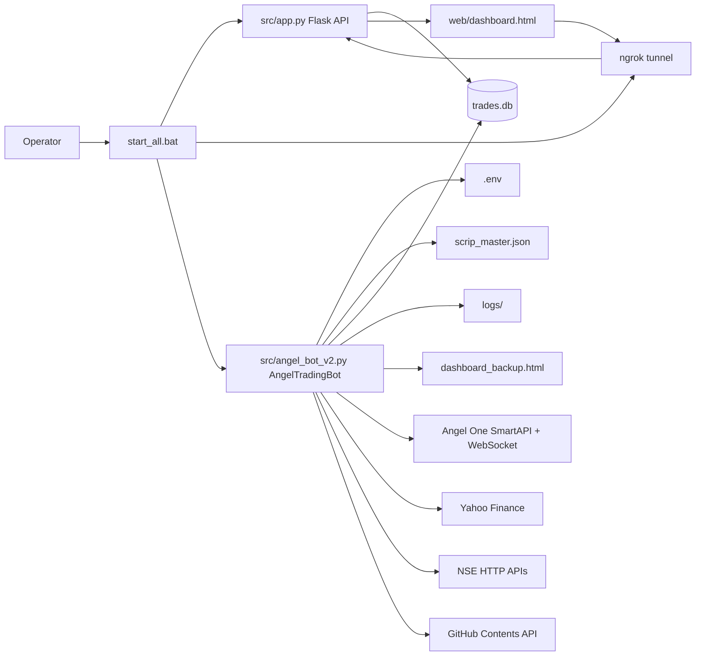
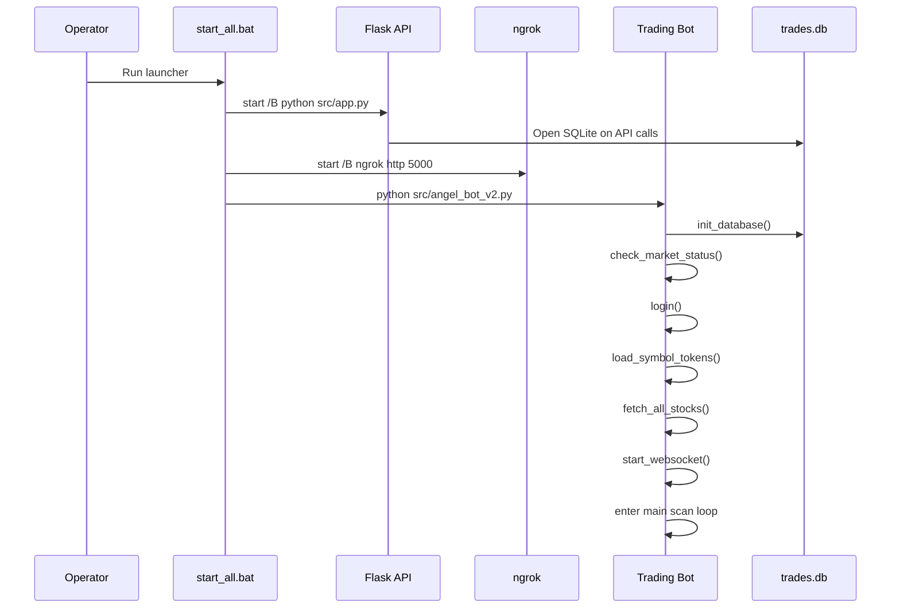

# Architecture

Generated: 2026-07-11

## Component Diagram



## Module Responsibilities

| Module/file | Responsibility |
|---|---|
| `start_all.bat` | Starts Flask, starts ngrok, then starts the bot process. |
| `src/app.py` | Serves the dashboard and exposes read-only JSON APIs over `trades.db`. |
| `src/angel_bot_v2.py` | Main bot engine: auth, symbols, market data, strategy scoring, risk management, paper execution, persistence, dashboard publishing, and loop control. |
| `web/dashboard.html` | Mobile-oriented dashboard UI that fetches stats from a hardcoded ngrok API base. |
| `web/manifest.json` | PWA metadata. |
| `trades.db` | SQLite database storing closed trades and initialized position schema. |
| `scrip_master.json` | Local Angel/NSE symbol-token mapping source. |
| `dashboard_backup.html` | Generated dashboard snapshot from bot runtime. |

## Dependencies

### Runtime Python Dependencies

Detected from imports:

- `SmartApi`
- `pyotp`
- `pandas`
- `numpy` (likely unused in active bot)
- `yfinance`
- `requests`
- `flask`
- `flask_cors`
- `python-dotenv`
- Optional: `nsepython`
- Standard library: `json`, `csv`, `io`, `time`, `datetime`, `logging`, `os`, `sys`, `threading`, `sqlite3`, `base64`, `math`, `concurrent.futures`

### Browser Dependencies

- Tailwind via CDN
- Chart.js via CDN

### External Services

- Angel One SmartAPI login/session APIs
- Angel One SmartWebSocketV2 market feed
- Yahoo Finance through `yfinance`
- NSE website/archive APIs
- GitHub Contents API for dashboard publication
- ngrok for public API exposure

## Startup Process



## Execution Flow

1. Initialize SQLite schema.
2. Check current trading day and market time.
3. Sleep recursively until market opens if closed.
4. Login to Angel One using `.env` credentials.
5. Read `scrip_master.json` and build symbol-token maps.
6. Load hardcoded sector map.
7. Fetch stock universe through tiered sources:
   - optional `nsepython`
   - NSE equity CSV
   - NSE bhavcopy
   - NSE website API
   - hardcoded fallback
8. Filter and score stocks using Yahoo price/volume data.
9. Start websocket subscriptions.
10. Repeat every `SCAN_INTERVAL` seconds:
    - validate trading day/time
    - enforce loss/square-off checks
    - check websocket health
    - update market condition
    - update bulk market data
    - check exits for open positions
    - scan and open new paper positions
    - render dashboard snapshot and optionally push to GitHub

## File Dependency Diagram

```mermaid
flowchart TD
    start[start_all.bat] --> app[src/app.py]
    start --> bot[src/angel_bot_v2.py]
    start --> ngrok[ngrok]

    app --> dashboard[web/dashboard.html]
    app --> db[(trades.db)]

    bot --> env[.env]
    bot --> scrip[scrip_master.json]
    bot --> db
    bot --> backup[dashboard_backup.html]
    bot --> logs[logs/paper_bot_DATE.log]
    bot --> smartapi[SmartApi]
    bot --> yfinance[yfinance]
    bot --> nse[NSE APIs]
    bot --> github[GitHub API]

    dashboard --> api[/api endpoints]
    api --> app
```

## Circular Dependencies

No active Python circular imports were detected. The active Python modules do not import each other:

- `src/app.py` is standalone and reads SQLite.
- `src/angel_bot_v2.py` is standalone and writes SQLite.

The coupling occurs through shared files and external processes rather than imports.

## Architectural Observations

- The bot is a large monolith. It should eventually be split into broker, market data, strategy, risk, execution, persistence, and publisher components.
- The dashboard API base is hardcoded to a specific ngrok URL, making deployments fragile.
- The active bot contains generated dashboard HTML inside Python, while Flask serves a separate static dashboard. This creates duplicated dashboard sources.
- Config files exist but are not authoritative for the active bot.
