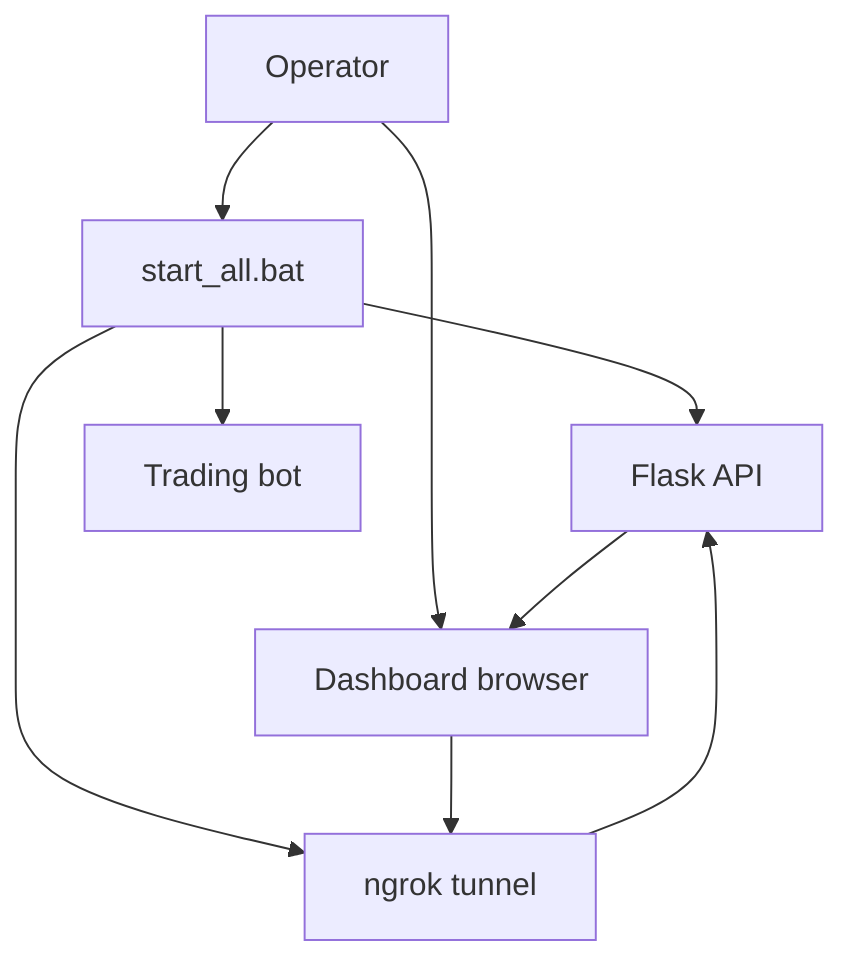
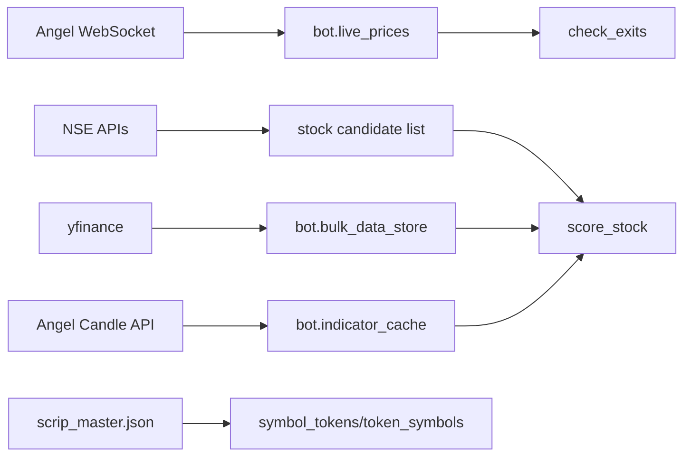
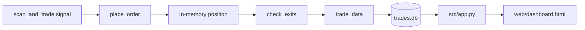
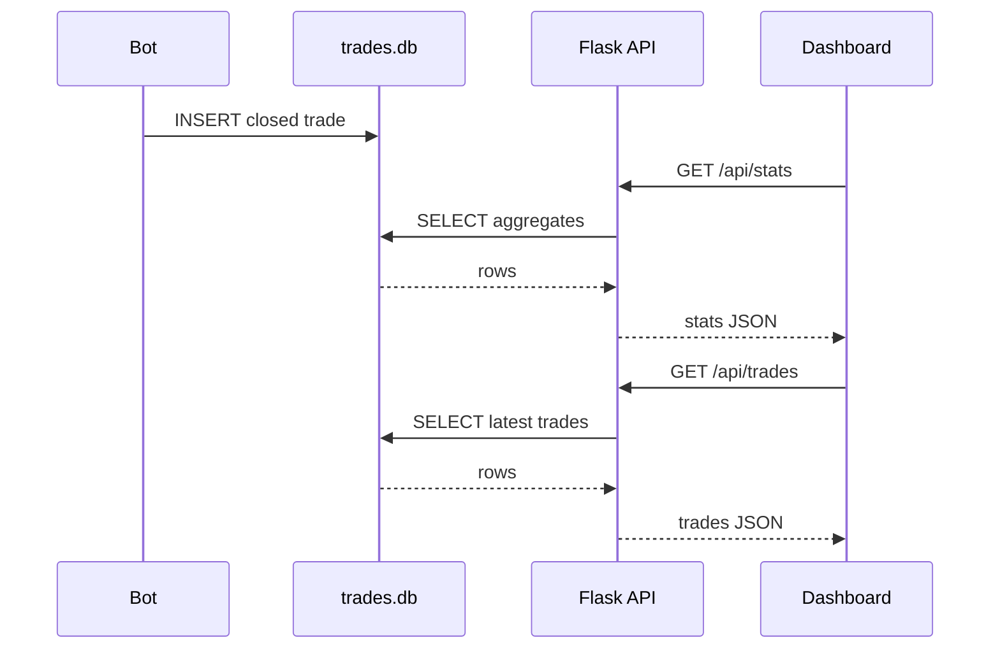

# Data Flow

Generated: 2026-07-11

## User Flow



1. Operator runs `start_all.bat`.
2. Flask API starts locally on port `5000`.
3. ngrok exposes the local API.
4. Trading bot starts and manages paper trades.
5. User opens dashboard.
6. Dashboard fetches JSON from the API.

## Internal Processing Flow

```mermaid
flowchart TD
    A[Bot run()] --> B[init_database()]
    B --> C[check_market_status()]
    C -->|closed| D[Sleep until market open/next day]
    D --> A
    C -->|open| E[login()]
    E --> F[load_symbol_tokens()]
    F --> G[load_sector_mapping()]
    G --> H[fetch_all_stocks()]
    H --> I[start_websocket()]
    I --> J[Main loop]
    J --> K[check_daily_loss_limit()]
    J --> L[check_and_square_off()]
    J --> M[check_ws_health()]
    J --> N[update_bulk_market_data()]
    J --> O[check_exits()]
    J --> P[scan_and_trade()]
    J --> Q[render_and_deploy_dashboard()]
    O --> R[save_trade()]
    R --> S[(trades.db)]
    P --> T[In-memory positions]
    Q --> U[dashboard_backup.html]
    Q --> V[GitHub Pages optional]
```

## External Integrations

| Integration | Direction | Used by | Purpose |
|---|---|---|---|
| Angel One SmartAPI | Outbound | `src/angel_bot_v2.py` | Broker login/session and historical candle requests. |
| Angel One SmartWebSocketV2 | Outbound websocket | `src/angel_bot_v2.py` | Live price feed for subscribed tokens. |
| Yahoo Finance | Outbound | `src/angel_bot_v2.py` | Historical and fallback live market data. |
| NSE archive/website APIs | Outbound | `src/angel_bot_v2.py` | Stock universe and holiday data. |
| GitHub Contents API | Outbound | `src/angel_bot_v2.py` | Optional dashboard publication to `index.html`. |
| ngrok | Inbound tunnel to local Flask | `start_all.bat`, browser dashboard | Exposes local API to public URL. |
| Tailwind CDN | Browser outbound | `web/dashboard.html` | Dashboard styling. |
| Chart.js CDN | Browser outbound | `web/dashboard.html` | Dashboard charts. |

## Market Data Movement



## Trade Data Movement



## API Data Movement



## Runtime State

The active bot keeps important state in memory:

- `positions`
- `capital`
- `available_capital`
- `live_prices`
- `price_update_time`
- `bulk_data_store`
- `indicator_cache`
- `trades`
- `daily_pnl`
- dashboard status counters

Only closed trade records are persisted to SQLite by `save_trade()`. Open positions are represented in memory and by a created but currently unused `positions` table.

## Data Consistency Notes

- Flask reads `trades.db` while the bot writes to it. SQLite handles basic concurrency, but there is no explicit retry/backoff for locked database errors.
- Open positions are not restored from SQLite after process restart.
- Dashboard active/open trade status is inferred from rows where `exit_time IS NULL`, but active bot inserts rows primarily on exit, so live open positions are not represented through the Flask DB APIs.
- The bot-generated `dashboard_backup.html` can show in-memory positions, but Flask serves `web/dashboard.html`, which reads from API/DB.
