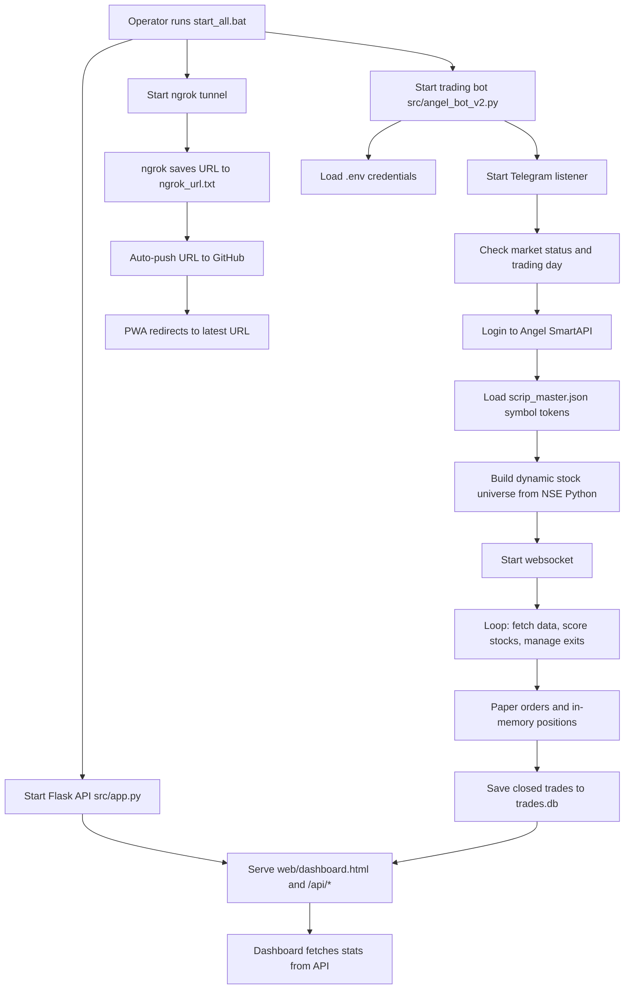

# System Overview

Generated: 2026-07-11

## Purpose

ALPHA is a Windows-oriented NSE/Angel One paper-trading system. It logs in to Angel One SmartAPI, builds a watchlist from local instrument data and market-data sources, scores intraday long setups, simulates paper trades, stores completed trades in SQLite, and exposes a dashboard through Flask.

The system is currently optimized for local operation from `start_all.bat` and for dashboard access through an ngrok tunnel.

## Features

- Angel One SmartAPI login using API key, client code, MPIN, and TOTP.
- Angel One websocket subscription for live price updates.
- Yahoo Finance fallback for live and historical prices.
- NSE stock-universe fetch attempts with hardcoded fallback.
- Intraday strategy scoring using VWAP, EMA, ORB, volume, and market filter checks.
- Paper order execution with margin accounting.
- Risk controls for max positions, daily loss, sector exposure, correlation, ATR/dynamic stop, volatility stop, trailing stop, partial exits, and end-of-day square-off.
- SQLite persistence for completed trades and position schema initialization.
- Flask API for trades, stats, PnL, performance, and market status.
- Static HTML dashboard with Chart.js and Tailwind CDN.
- Optional GitHub Pages dashboard sync from the bot-generated dashboard HTML.

## New Features (v2.1)

### PWA Dashboard with Auto-Redirect
- Mobile-first PWA dashboard accessible via GitHub Pages
- Automatically redirects to the latest ngrok URL
- Auto-syncs ngrok URL to GitHub on each bot startup
- Real-time data with auto-refresh every 30 seconds
- Rate limit increased to 120 requests per minute for smoother browsing

### Telegram Remote Control
- 14 commands for remote monitoring and control
- Commands work 24/7 (even when market is closed)
- Multiple chat support for group notifications
- Alert frequency control (60s cooldown)
- Performance alerts for milestones (3 wins, 2 losses, ₹500 profit)

### Enhanced Data Sources
- **NSE Python** as primary data source (fast & free)
- **Angel One API** as secondary
- **Yahoo Finance** as fallback
- Circuit breaker with auto-reset (10 failures, 30s timeout)

### Smart Stock Selection
- Dynamic universe of 500+ stocks (up from 29)
- Market cap filter (> ₹500 Cr)
- Sector momentum detection
- 4-tier data source hierarchy for reliability

## Architecture

The active system has three runtime processes:

1. `src/app.py` starts a Flask API server on port `5000`.
2. `src/angel_bot_v2.py` starts the trading bot loop.
3. `ngrok` creates a secure tunnel for external dashboard access.

`start_all.bat` starts all three and automatically pushes the ngrok URL to GitHub for the PWA.

### Data Source Hierarchy
1. **NSE Python** (Primary - fast, free)
2. **Angel One API** (Secondary)
3. **Yahoo Finance** (Fallback)
4. **Bulk Data Store** (Emergency)

### Telegram Integration
- Incoming commands processed by `TelegramBotHandler` class
- Listener runs 24/7 in a background thread
- 14 commands available for remote control
- Multiple chat support via `TELEGRAM_CHAT_IDS`

### PWA Dashboard
- GitHub Pages serves `index.html` (smart redirector)
- Redirects to current ngrok URL
- Auto-updates when ngrok URL changes
- Installed as PWA on mobile devices

## Folder Structure

```text
trading-bot/
  src/
    angel_bot_v2.py       Active trading bot engine
    app.py                Active Flask API/dashboard server
    __init__.py           Package marker
  web/
    dashboard.html        Served dashboard UI
    manifest.json         PWA manifest asset
  config/
    config.yaml           Intended trading config, not wired into active bot
    paper_trading_config.yaml
    holidays.txt
  data/
    stock_config.json     Intended stock selection config, not wired into active bot
  logs/                   Runtime logs and legacy CSV outputs
  reports/                Historical paper trade reports
  archive/                Legacy scripts, old dashboards, archived placeholders
  docs/                   Generated technical documentation
  start_all.bat           Local launcher
  trades.db               SQLite runtime database
  scrip_master.json       Angel/NSE instrument master
  dashboard_backup.html   Generated dashboard snapshot
```

## High-Level Workflow



## Assumptions

- `start_all.bat` is the canonical local startup path because it is the only launcher that starts both active Python processes.
- `config/*.yaml` and `data/stock_config.json` are intended future configuration sources, but active code currently uses constants in `src/angel_bot_v2.py`.
- `dashboard_backup.html` is runtime-generated and useful as an artifact, but it is not served by Flask unless manually opened or deployed.

## Monitoring & Control

### Telegram Commands
| Command | Description |
|---------|-------------|
| `/status` | Show bot status |
| `/health` | Health check |
| `/positions` | Open positions |
| `/trades` | Recent trades |
| `/scan` | Force scan |
| `/restart` | Restart bot |
| `/stop` | Stop trading |
| `/start` | Resume trading |
| `/ws` | WebSocket status |
| `/reconnect` | Reconnect WS |
| `/ping` | Check if alive |
| `/help` | Show commands |
| `/logs` | Recent logs |
| `/reset` | Reset circuit breaker |

### Dashboard URLs
| Access | URL |
|--------|-----|
| **Local** | `http://localhost:5000` |
| **ngrok** | Auto-generated, saved to `ngrok_url.txt` |
| **PWA** | `https://anjanib31-source.github.io/trading-dashboard/` |

### Rate Limiting
- API rate limit: 120 requests per minute
- Telegram command cooldown: 5 seconds
- Alert cooldown: 60 seconds