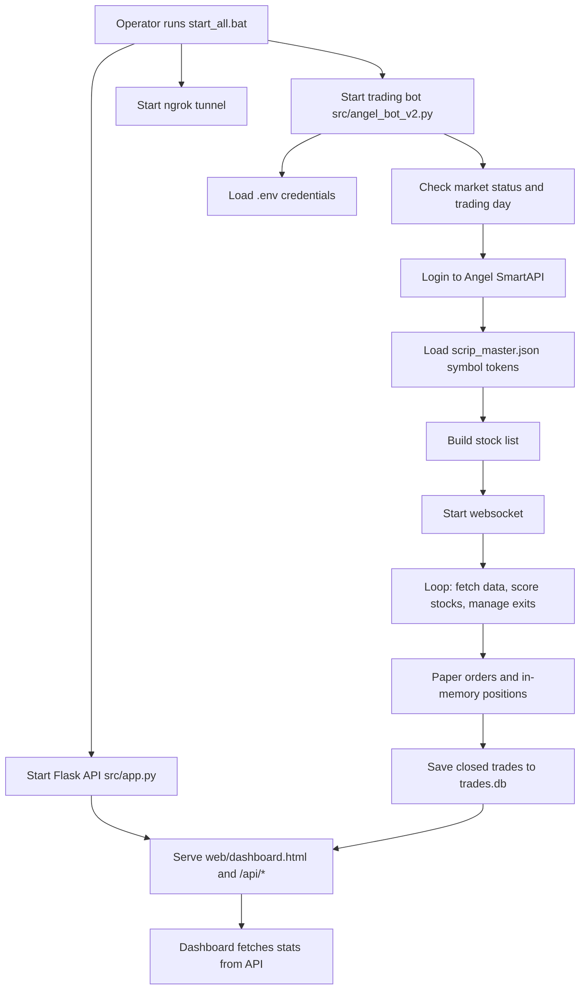

# System Overview

Generated: 2026-07-11

## Purpose

ALPHA is a Windows-oriented NSE/Angel One paper-trading system. It logs in to Angel One SmartAPI, builds a watchlist from local instrument data and market-data sources, scores intraday long setups, simulates paper trades, stores completed trades in SQLite, and exposes a dashboard through Flask.

The system is currently optimized for local operation from `start_all.bat` and for dashboard access through an ngrok tunnel.

## Features

- Angel One SmartAPI login using API key, client code, MPIN, and TOTP.
- Angel One websocket subscription for live price updates.
- Yahoo Finance fallback for live and historical prices.
- NSE stock-universe fetch attempts with hardcoded fallback.
- Intraday strategy scoring using VWAP, EMA, ORB, volume, and market filter checks.
- Paper order execution with margin accounting.
- Risk controls for max positions, daily loss, sector exposure, correlation, ATR/dynamic stop, volatility stop, trailing stop, partial exits, and end-of-day square-off.
- SQLite persistence for completed trades and position schema initialization.
- Flask API for trades, stats, PnL, performance, and market status.
- Static HTML dashboard with Chart.js and Tailwind CDN.
- Optional GitHub Pages dashboard sync from the bot-generated dashboard HTML.

## Architecture

The active system has two runtime processes:

1. `src/app.py` starts a Flask API server on port `5000`.
2. `src/angel_bot_v2.py` starts the trading bot loop.

`start_all.bat` also starts `ngrok http 5000` so a public dashboard URL can reach the local Flask API.

The active architecture is monolithic inside `src/angel_bot_v2.py`. Most concerns are implemented in one `AngelTradingBot` class: auth, market data, scoring, risk, execution, persistence, dashboard generation, GitHub publishing, market calendar checks, and the main loop.

## Folder Structure

```text
trading-bot/
  src/
    angel_bot_v2.py       Active trading bot engine
    app.py                Active Flask API/dashboard server
    __init__.py           Package marker
  web/
    dashboard.html        Served dashboard UI
    manifest.json         PWA manifest asset
  config/
    config.yaml           Intended trading config, not wired into active bot
    paper_trading_config.yaml
    holidays.txt
  data/
    stock_config.json     Intended stock selection config, not wired into active bot
  logs/                   Runtime logs and legacy CSV outputs
  reports/                Historical paper trade reports
  archive/                Legacy scripts, old dashboards, archived placeholders
  docs/                   Generated technical documentation
  start_all.bat           Local launcher
  trades.db               SQLite runtime database
  scrip_master.json       Angel/NSE instrument master
  dashboard_backup.html   Generated dashboard snapshot
```

## High-Level Workflow



## Assumptions

- `start_all.bat` is the canonical local startup path because it is the only launcher that starts both active Python processes.
- `config/*.yaml` and `data/stock_config.json` are intended future configuration sources, but active code currently uses constants in `src/angel_bot_v2.py`.
- `dashboard_backup.html` is runtime-generated and useful as an artifact, but it is not served by Flask unless manually opened or deployed.
